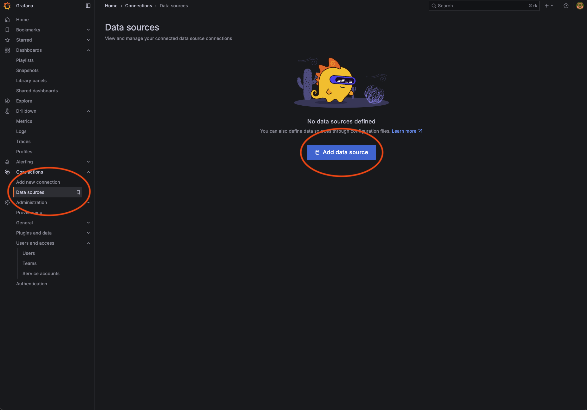
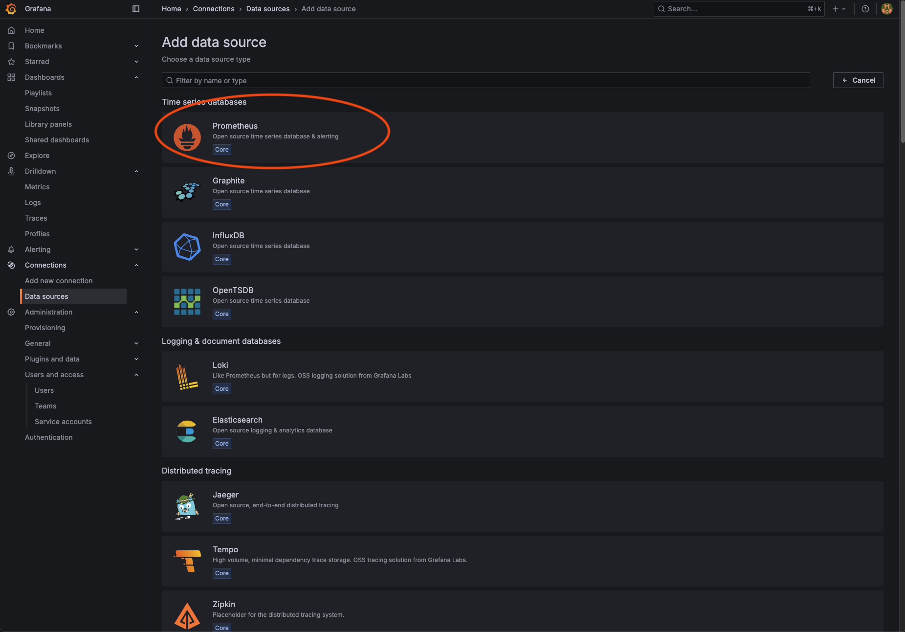
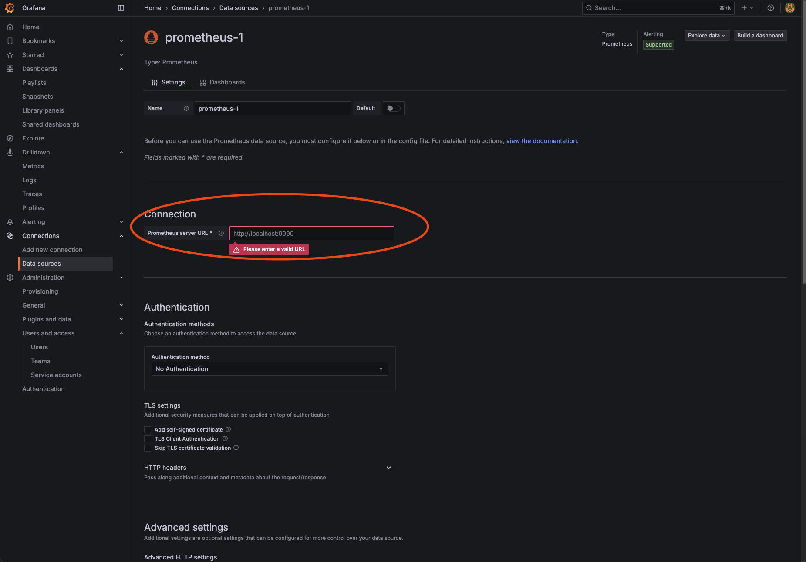
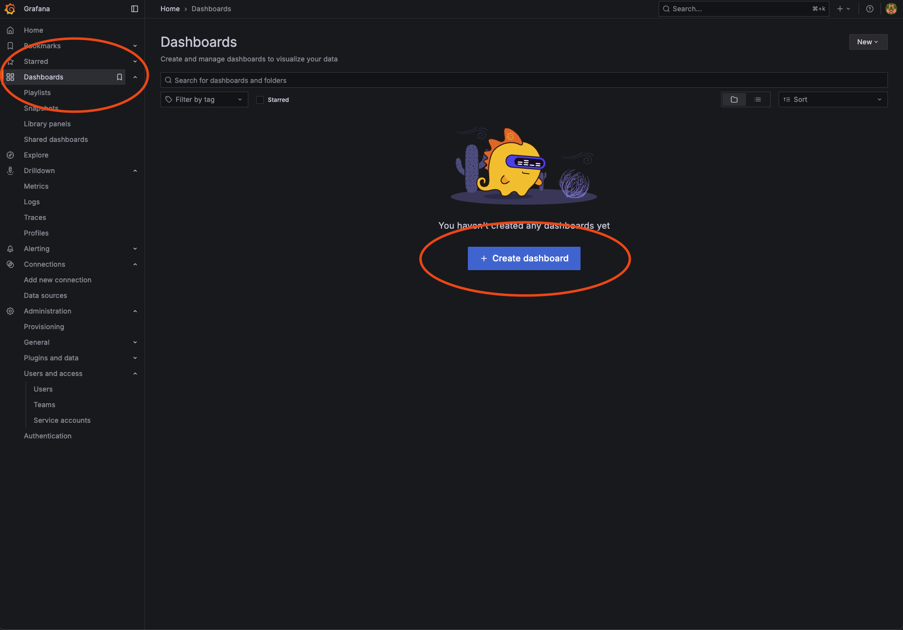
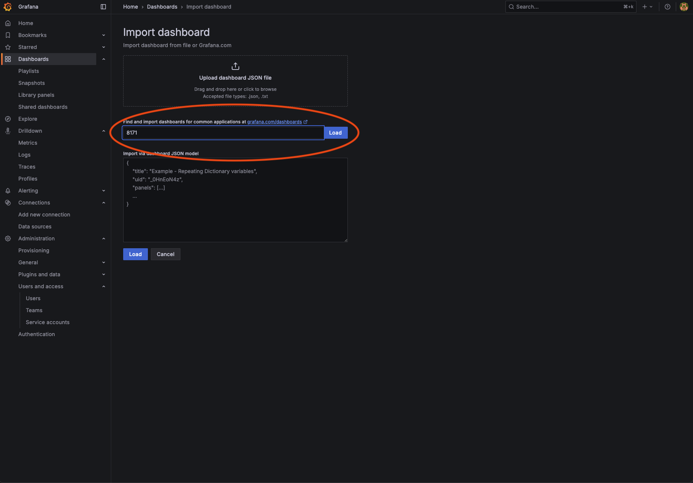
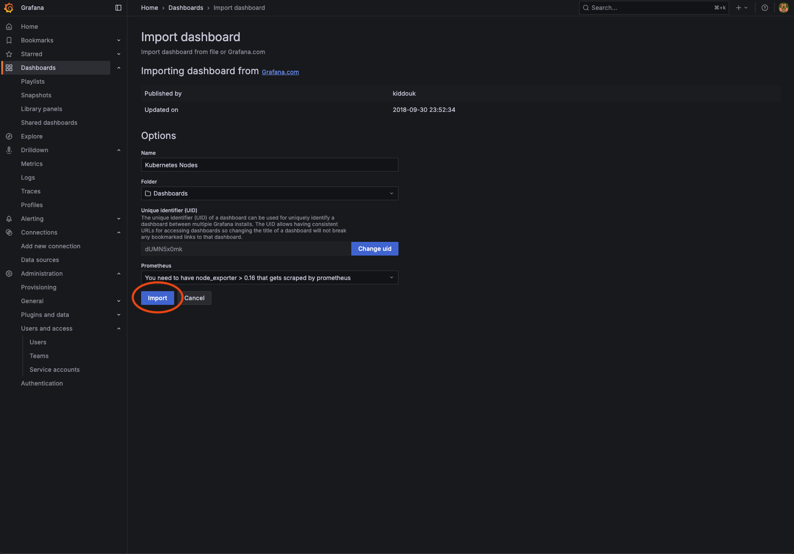

> NOTE: This is a rough record of my journey to set up my Kubernetes cluster. I'm going to migrate this to an article or better documentation when I get the chance.

# Cluster Setup

The following is a loose record of exactly how I managed to set up my own home Kubernetes cluster. It is useful for others following this path or for myself in 6 months when I can't remember all of this.

## Node Hardware

I used Raspberry Pi 5 devices, specifically the 16gb version (4 CPU cores each, so 16 total CPU cores + 64gb memory). I decided to run the cluster initially with 4 of them.

I plan to add a full PC with a 5090 to the cluster to allow for scheduling model training in the cluster.

Here's the list of what I bought for each of the main control/worker nodes:
1. [Raspberry Pi 5](https://www.amazon.com/dp/B0DSPYPKRG)
2. [NVMe + POE+ Pi 5 Hat and Active Cooler](https://www.amazon.com/dp/B0D8JC3MXQ)
3. [Samsung 2TB NVMe SSD](https://www.amazon.com/dp/B0DHLCRF91)
4. [256gb Micro SD Card](https://www.amazon.com/dp/B08TJZDJ4D)

## Node OS Software Installation

After putting together your hardware, you'll need to go ahead and flash the Pi OS to an SD card. I used micro SD cards for the boot drive (the NVMe drives are for all other data used in the kube cluster).

Download [Raspberry Pi Imager](https://www.raspberrypi.com/software/) and connect your micro SD card.

When going through the flow, select the following options:

1. Choose Raspberry Pi 5 for the device
2. `Raspberry Pi OS 64 bit`
3. Choose your SD card as the storage to write to
4. Edit settings under `General` and set the hostname, a username/password for SSH (although we won't use it), configure the LAN, and set your locale
5. Also, go to `Services` and enable SSH. I'd allow public-key authentication only (and set an authorized_keys key for your account)

Go ahead and write to the device. Once it's done, remove your micro SD card.

Insert it into the Pi and power it up. Your Pi will initiate the headless boot process, but you should be able to ssh into it eventually via:

```bash
ssh <your username>@<Pi IP address>.local
```

Great job. You're ssh-ed into your Pi!

## Node Networking

You'll want to setup static IP addresses for your Pi devices. You should assign these on your router itself (whatever router setup you have).

This will be unique to you, so I'll leave you to research this out and do it your yourself.

After doing that, you should be able to ssh into Pis via `<your username>@<Pi IP address>`. To be able to reference all of your Pis by hostname on your main machine (such as your computer you're reading this on now), update your `/etc/hosts` file to list all of your Pis:

```bash
# Kubernetes cluster nodes
192.168.0.11        node1 node1.local # Control node
192.168.0.12        node2 node2.local
192.168.0.13        node3 node3.local
192.168.0.14        node4 node4.local
```

Next (while ssh-ed into each of your Pis), install the DHCP server for each device via this command:

```bash
sudo apt upgrade
sudo apt install dhcpcd5 # The 5 here is correct
sudo systemctl enable dhcpcd
sudo systemctl start dhcpcd
```

Then, add a static IP to the `dchpcd.conf` file:

```bash
sudo nano /etc/dhcpcd.conf

# Add something like this to the bottom. It will be different for you depending on your router IP ranges.
interface eth0
static ip_address=192.168.0.18/24
static routers=192.168.0.1
static domain_name_servers=1.1.1.1 8.8.8.8
```

Flush your DHCP leases and restart your Pi afterwards:

```bash
sudo ip addr flush dev wlan0
sudo systemctl restart dhcpcd
sudo reboot
ip addr show wlan0 # Check for correct IP assignment
```

If you used the Raspberry Pi OS instead of Debian (or some Ubuntu flavor), you'll need to instead run these commands:

```bash
# Check status of wired connection - should show something like "Wired connection 1"
nmcli con show

# Set static IP
sudo nmcli con mod "Wired connection 1" ipv4.addresses <your initial IP for IP range here>/24
sudo nmcli con mod "Wired connection 1" ipv4.gateway <your gateway IP>
sudo nmcli con mod "Wired connection 1" ipv4.dns "<your gateway IP> 8.8.8.8"
sudo nmcli con mod "Wired connection 1" ipv4.method manual
sudo nmcli con up "Wired connection 1"

# Turn off Wifi
sudo nmcli radio wifi off
sudo systemctl disable wpa_supplicant

# As an aside, you can turn wifi on at any time you want with this
sudo nmcli radio wifi on
sudo systemctl enable wpa_supplicant
sudo systemctl start wpa_supplicant
```

The above + setting static IP at your router level should be sufficient.

Next, turn off wifi:

```bash
sudo nmcli radio wifi off
sudo systemctl disable wpa_supplicant
sudo ip link set wlan0 down

# Check that WIFI is disabled
nmcli radio
```

Next, set a static hostname on the network. Example:

```bash
sudo hostnamectl set-hostname some-cool-pi-name-here
```

If you're using ethernet connections like me, you'll also want to disable Wi-Fi for cluster stability:

```bash
echo "dtoverlay=disable-wifi" | sudo tee -a /boot/config.txt
```

Also, set the CPU governer to `schedutil` so that you can control CPU frequency scaling for balanced performance and power usage:

```bash
# This will make it persistent across reboots which is what you want
sudo apt install -y cpufrequtils
echo 'GOVERNOR="schedutil"' | sudo tee /etc/default/cpufrequtils
```

Do this on every single one of your Pis after booting them up. Next, check the network from your control node via:

```bash
#switch to root
sudo -s
#install nmap
apt install nmap
#scan local network range to see who is up
nmap -sP 192.168.0.1-254
```

Then, edit your `/etc/hosts` file on the control node (whichever one you choose). Here's an example of mine:

```bash
127.0.1.1       node1 # There's already a localhost one, but add this as well

192.168.0.11    node1 node1.local # Control node
192.168.0.12    node2 node2.local
192.168.0.13    node3 node3.local
192.168.0.14    node4 node4.local
```

Next, we need to generate an RSA key and distribute it to our worker nodes in order for us to issue ssh commands from inside our control node. I'd advise NOT reusing your own SSH key you're using right now already to connect to each of the nodes. Ideally, we'll be able to tell later if the intra-node SSH key was being used.

Run this on your control node Pi:

```bash
ssh-keygen -t ed25519 -C "ansible_key" -f ~/.ssh/anbsible_id_ed25519
```

Then, copy it to your computer and then to other Pis in the cluster. This will allow the control node to ssh into them:

```bash
# Copy from control node Pi to computer
scp <your ssh username>@<your control node pi name>.local:~/.ssh/anbsible_id_ed25519.pub ~/ansible_id_ed25519.pub
scp <your ssh username>@<your control node pi name>.local:~/.ssh/anbsible_id_ed25519 ~/ansible_id_ed25519

# Copy from your computer to Pis
ssh-copy-id -i ~/ansible_id_ed25519.pub -f <your username>@node2
```

Next, we're going to use a tool called Ansible to set up remote control over all our nodes. It will effectively allow us to issue install commands or customize all our nodes at once via single commands.

Run the following commands:

```bash
# You may need to run this as root
sudo -i

# Install ansible
apt install ansible
```

Next, you'll want to create a file called `/etc/ansible/hosts` and add all our hosts to it. We're defining hosts and groups of hosts that Ansible will try to manage for us:

```bash
# To edit the file (you make have to create this file)
sudo nano /etc/ansible/hosts

# File /etc/ansible/hosts
[control]
node1  ansible_connection=local

[workers]
node2  ansible_connection=ssh
node3  ansible_connection=ssh
node4  ansible_connection=ssh

[cube:children]
control
workers
```

Above, you can see I have added 3 groups: `control`, `workers` and `cube`. Name of the group is the one in between [ ]. This was split so that if I want to execute some actions only on control server, I use the “control” group. Group “cube” has children. This basically means that it’s a group of groups, and when I’m using cube I’m targeting every single node from the listed groups.

Variable: `ansible_connection`: we are telling Ansible how to connect to that host. The primary method is ssh, but I specified “local” for `node1`, because this is the node that we are running Ansible from. This way, it won’t try to ssh to itself.

Lastly, we are going to make it so that user root will be able to log in to other nodes from `node1` without the password using an ssh key. This step is optional, but after this you won’t need to type the password every time you run Ansible.

Once this is set up, you can do a test run of Ansible with this command:

```bash
# Test pinging all control + worker nodes to verify they are setup correctly
ansible cube -m ping

## Response
node1 | SUCCESS => {
    "ansible_facts": {
        "discovered_interpreter_python": "/usr/bin/python3"
    },
    "changed": false,
    "ping": "pong"
}
node2 | SUCCESS => {
    "ansible_facts": {
        "discovered_interpreter_python": "/usr/bin/python3"
    },
    "changed": false,
    "ping": "pong"
}
node3 | SUCCESS => {
    "ansible_facts": {
        "discovered_interpreter_python": "/usr/bin/python3"
    },
    "changed": false,
    "ping": "pong"
}
node4 | SUCCESS => {
    "ansible_facts": {
        "discovered_interpreter_python": "/usr/bin/python3"
    },
    "changed": false,
    "ping": "pong"
}
```

Also, install iptables on all of the nodes via this process (needed for k3s/Kubernetes):

```bash
# Install
ansible cube -m apt -a "name=iptables state=present" --become

# Reboot
ansible workers -b -m shell -a "reboot"

# Alternately, manually install on each node
apt -y install iptables
```

Finally, logout of the control node and get ready for the next section:

```bash
logout
```

By the way, you can get CPUs temperature, RP1 I/O controller temperature, SSD temperature, and fan speed:

```bash
ansible all -m shell -a "sudo apt update -y && sudo apt install -y lm-sensors && yes | sudo sensors-detect && echo CPU: \$((\$(cat /sys/class/thermal/thermal_zone0/temp)/1000))°C && sensors 2>/dev/null || true"
```

If you're just interested in core temps, use this command after installing `lm-sensors` on every node:

```bash
ansible cube -m shell -a "sensors"
```

TODO: Add additional useful ansible commands (shoudl work out of the box if all other steps in this guide are followed) including:

```bash
# Get sensor temp readings (CPU, NVMe, memory)
ansible cube -m shell -a "sensors"

# Get sensor temp readings (CPU, NVMe, memory) + Nvidia GPU temp readings
ansible cube -m shell -a "sensors && nvidia-smi --query-gpu=temperature.gpu --format=csv,noheader"
```

## Setting Up Kubernetes / K3s

At any time during this guide, you can run the following commands to start/stop k3s:

```bash
# Stop k3s
sudo systemctl stop k3s

# Start k3s
sudo systemctl restart k3s

# Check status
sudo systemctl status k3s
```

First, set memory constraints for every node (including control) via appending this to the end of `/boot/firmware/cmdline.txt` (you will need to open with `sudo`):

```bash
cgroup_enable=memory cgroup_memory=1 cgroup_enable=cpuset swapaccount=1

# Reboot when you're done
sudo reboot
```

Install k3s via this command:

```bash
# Install
curl -sfL https://get.k3s.io | sh -s - --write-kubeconfig-mode 644 --disable servicelb --token <some random password> --node-taint CriticalAddonsOnly=true:NoExecute --bind-address <control node ip address> --disable-cloud-controller --disable local-storage

# Verify the node taint with this
kubectl describe node node1 | grep -i taint
```

If you want to remove the taint (which prevents non-critical resources, like your apps, from being installed and having pods run on the control node), run this:

```bash
kubectl taint nodes <your control node name> CriticalAddonsOnly=true:NoExecute-
```

Be sure to replace "some_random_password" with a password you save and preserve. You'll need this to connect to the main k3s master node. Replace the bind address flag IP with your control node's IP that you set earlier.

Once you run and install this via the `curl` command, check the installation with `kubectl`:

```bash
# Check nodes
kubectl get nodes

# Listing out
NAME   STATUS     ROLES                  AGE     VERSION
node1   Ready      control-plane,master   10m     v1.33.3+k3s1
```

After this, you'll need to install k3s onto your worker nodes which you can do with Ansible:

```bash
ansible workers -b -m shell -a "curl -sfL https://get.k3s.io | K3S_URL=https://<your control node IP>:6443 K3S_TOKEN=some_random_password sh -"
```

Once you've done this, verify this worked via:

```bash
# Checking if it worked
kubectl get nodes

# Response with nodes in cluster
NAME    STATUS     ROLES                  AGE     VERSION
node1   Ready      control-plane,master   10m     v1.33.3+k3s1
node2   Ready      <none>                 3m32s   v1.33.3+k3s1
node3   Ready      <none>                 3m32s   v1.33.3+k3s1
node3   Ready      <none>                 3m32s   v1.33.3+k3s1
```

If you're interested in total resources now in the cluster, you can check with this command:

```bash
# Long
kubectl get nodes -o custom-columns=NAME:.metadata.name,CPU:.status.capacity.cpu,MEM:.status.capacity.memory
```

You should also probably label the other nodes, so do something like this:

```bash
# Labels for cosmetic reasons
kubectl label nodes node2 kubernetes.io/role=worker
kubectl label nodes node3 kubernetes.io/role=worker
kubectl label nodes node4 kubernetes.io/role=worker
kubectl label nodes node5 kubernetes.io/role=worker
kubectl label nodes node6 kubernetes.io/role=worker

# Labels used for directing deployments to prefer certain nodes
kubectl label nodes node2 node-type=worker
kubectl label nodes node3 node-type=worker
kubectl label nodes node4 node-type=worker
kubectl label nodes node3 node-type=worker
kubectl label nodes node6 node-type=worker
```

Verify via showing all labels:

```bash
kubectl get nodes --show-labels
```

Show any taints with this command:

```bash
kubectl get nodes -o custom-columns=NAME:.metadata.name,TAINTS:.spec.taints --no-headers
```

Lastly, change the source of the kubeconfig like so via Ansible:

```bash
ansible cube -b -K -m lineinfile -a "path='/etc/environment' line='KUBECONFIG=/etc/rancher/k3s/k3s.yaml'"
```

This is the source of truth for each of the kube deployments (client and servers for control and workers).

From this point forward, you can get all your pods and states by using this:

```bash
kubectl get pods --all-namespaces -o wide
```

If you ever want to upgrade the version on each of the nodes, you can just run these commands:

```bash
# Upgrading control node
sudo k3s-uninstall.sh
curl -sfL https://get.k3s.io | INSTALL_K3S_VERSION=<version-such-as-v1.33.5+k3s1> sh -

# Upgrading agents (workers) nodes
curl -sfL https://get.k3s.io | INSTALL_K3S_VERSION=<version-such-as-v1.33.5+k3s1> K3S_URL=https://<server>:6443 K3S_TOKEN=<token> sh -
```

## Setting Up Helm

Next, we need to install Helm in order to make use of Helm charts. Run this on the control node Pi:

```bash
curl -fsSL https://raw.githubusercontent.com/helm/helm/main/scripts/get-helm-3 | bash
```

That's it! Onwards!

## Swapping Traefik for Metallb

K3s comes with Traefik which is pretty great. However, we want to be able to assign an external IP to service (like our dashboards), and it's just not as customizable as we'd like.

Instead, let's move to using `metallb` as our load balancer for the cluster. [Documentation](https://metallb.io/?ref=rpi4cluster.com)

Run these commands on your control node to install it:

```bash
# First add metallb repository to your helm
helm repo add metallb https://metallb.github.io/metallb

# Check if it was found
helm search repo metallb

# Install metallb
helm upgrade --install metallb metallb/metallb --create-namespace \
--namespace metallb-system --wait
```

The command may take a second. You can check in another terminal tab while ssh-ed into your control node to check the installation process:

```bash
kubectl get pods -n metallb-system
```

Once install is done, the command from above will finish. If it hands longer than ~5 minutes, you have networking issues you'll need to resolve and god help you.

Finally, apply this custum resource definition:

```bash
cat << 'EOF' | kubectl apply -f -
apiVersion: metallb.io/v1beta1
kind: IPAddressPool
metadata:
  name: default-pool
  namespace: metallb-system
spec:
  addresses:
  - 192.168.0.200-192.168.0.250 # replace this with your own IP range
---
apiVersion: metallb.io/v1beta1
kind: L2Advertisement
metadata:
  name: default
  namespace: metallb-system
spec:
  ipAddressPools:
  - default-pool
EOF
```

## Storage

Next, we're going to boostrap Longhorn for our file storage. This will enable us to use the NVMe drives on our Pis. We'll later move to using ArgoCD and Helm charts as the source of truth for these, but that will come later.

Run these on the control node:

```bash
ansible cube -b -K -m apt -a "name=nfs-common state=present"
ansible cube -b -K -m apt -a "name=open-iscsi state=present"
ansible cube -b -K -m apt -a "name=util-linux state=present"
```

We'll be using Ansible a ton for this setup which will make all the pain there worth it.

Go ahead and run this command to see all disk labels:

```bash
ansible cube -b -m shell -a "lsblk -f"
```

If you decided to go the route of NVMEs like I did, you'll actually need to format them.

First, set the below in your `/etc/ansible/hosts`:

```bash
sudo nano /etc/ansible/hosts

# File /etc/ansible/hosts
[control]
node1  ansible_connection=local var_hostname=node1 var_disk=<your nvme drive name here>

[workers]
node2  ansible_connection=ssh var_hostname=node2 var_disk=<your nvme drive name here>
node3  ansible_connection=ssh var_hostname=node3 var_disk=<your nvme drive name here>
node4  ansible_connection=ssh var_hostname=node4 var_disk=<your nvme drive name here>

[cube:children]
control
workers
```

Then, run these commands (but triple check you set the right drives above beforehand):

```bash
# Wipe
ansible cube -b -K -m shell -a "wipefs -a /dev/{{ var_disk }}"

# Format to ext4
ansible cube -b -K -m filesystem -a "fstype=ext4 dev=/dev/{{ var_disk }}"
```

Afterwards, get all drives and their available sizes with this command:

```bash
ansible cube -b  -K-m shell -a "lsblk -f"

# Response
node1 | CHANGED | rc=0 >>
f1f2c384-4619-4a93-be82-42bbfee0269c
node2 | CHANGED | rc=0 >>
5002bfe6-dcd1-4814-85ab-54b9c0fe710e
node3 | CHANGED | rc=0 >>
4f92985d-5d8f-4429-ab2c-b10c650a5d0b
node4 | CHANGED | rc=0 >>
b114d056-c935-4410-b490-02a3302b38d2
```

We'll get unique UUIDs for the drives in case the paths change. Let's go ahead and update our Ansible config to use these:

```bash
[control]
node1  ansible_connection=local var_hostname=node1 var_disk=<your nvme drive name here> var_uuid=<your drive UUID here>

[workers]
node2  ansible_connection=ssh var_hostname=node2 var_disk=<your nvme drive name here> var_uuid=<your drive UUID here>
node3  ansible_connection=ssh var_hostname=node3 var_disk=<your nvme drive name here> var_uuid=<your drive UUID here>
node4  ansible_connection=ssh var_hostname=node4 var_disk=<your nvme drive name here> var_uuid=<your drive UUID here>

[cube:children]
control
workers
```

Next, we'll go ahead and mount the storage disks via this command:

```bash
ansible cube -b -K -m ansible.posix.mount -a "path=/storage01 src=UUID={{ var_uuid }} fstype=ext4 state=mounted"
```

We'll now install longhorn to be able to interact with these drives. Fortunately, we can just use Helm again for this. We'll make ArgoCD pages to deploy it later:

```bash
# Run these on the control node
cd
helm repo add longhorn https://charts.longhorn.io
helm repo update
helm install longhorn longhorn/longhorn --namespace longhorn-system --create-namespace --set defaultSettings.defaultDataPath="/storage01" --version 1.9.1
```

I had a lot of trouble getting this to work correctly and had to fully delete all the resources and reinstall several times.

You can check the pods for the deployment and the CRDs with these commands:

```bash
# Pods
kubectl -n longhorn-system get pod

# Response
NAME                                                READY   STATUS      RESTARTS   AGE
discover-proc-kubelet-cmdline                       0/1     Completed   0          31s
engine-image-ei-b4bcf0a5-4c2tt                      1/1     Running     0          96s
engine-image-ei-b4bcf0a5-fplzs                      1/1     Running     0          96s
engine-image-ei-b4bcf0a5-nptbl                      1/1     Running     0          96s
engine-image-ei-b4bcf0a5-ttmhg                      1/1     Running     0          96s
instance-manager-4a529424618fd898f5b182591ed252d1   1/1     Running     0          63s
instance-manager-8acb062def932e1d509146c2b7564a73   1/1     Running     0          57s
instance-manager-f6f0478e3af0dd0843f02cb22a7f591b   1/1     Running     0          66s
instance-manager-f7413a220c4171cc02cca50a7900a7f1   1/1     Running     0          51s
longhorn-driver-deployer-5647c54d4f-mdhzv           1/1     Running     0          2m2s
longhorn-manager-96glw                              2/2     Running     0          2m2s
longhorn-manager-dt58x                              2/2     Running     0          2m2s
longhorn-manager-vclq5                              2/2     Running     0          2m2s
longhorn-manager-vfm6f                              2/2     Running     0          2m2s
longhorn-ui-8666455ff7-vnkm5                        1/1     Running     0          2m2s
longhorn-ui-8666455ff7-zmlwv                        1/1     Running     0          2m2s

# CRDs
kubectl get crds | grep engineimages

# Response
engineimages.longhorn.io                    2025-08-19T20:30:35Z
```

Next, apply a config for it here:

```bash
# On your control node
touch longhorn.yaml

# File contents
apiVersion: v1
kind: Service
metadata:
  name: longhorn-ingress-lb
  namespace: longhorn-system
spec:
  selector:
    app: longhorn-ui
  type: LoadBalancer
  loadBalancerIP: <one of your IPs from the metallb range here>
  ports:
    - name: http
      protocol: TCP
      port: 80
      targetPort: http

# Then apply
kubectl apply -f longhorn.yaml
```

Before we finish, verify that Longhorn is now the default storage class:

```bash
# Run this command
kubectl get storageclass

# You'll get a response lik
NAME                 PROVISIONER          RECLAIMPOLICY   VOLUMEBINDINGMODE   ALLOWVOLUMEEXPANSION   AGE
longhorn (default)   driver.longhorn.io   Delete          Immediate           true                   2m30s
longhorn-static      driver.longhorn.io   Delete          Immediate           true                   2m27s
```

Finally, I personally wanted my control node to be able to participate in distributed storage with its NVMe drive. I used this patch for the config to allow this even though the control node has a taint:

```bash
kubectl -n longhorn-system patch daemonset longhorn-manager \
  -p '{"spec":{"template":{"spec":{"tolerations":[{"key":"CriticalAddonsOnly","operator":"Equal","value":"true","effect":"NoExecute"}]}}}}'
```

## Bootstrapping ArgoCD

This repo has a variety of services and architecture patterns. Initially on the Kube cluster, we'll want to bootstrap a ArgoCD installation which will then point to this repo and allow Argo to start deploying itself as well as other services. This repo has an app-of-apps architecture pattern for deployments.

First, create a namespace for ArgoCD (we'll later set up Terraform to handle this for us, but we're bootstrapping at the moment):

```bash
# Create the namespace
kubectl create namespace argocd

# Install ArgoCD
kubectl apply -n argocd -f https://raw.githubusercontent.com/argoproj/argo-cd/stable/manifests/install.yaml

# Validate the install worked 
kubectl get pods -n argocd
kubectl get svc -n argocd
```

Patch this to be a LoadBalancer type deployment so you can have an external IP here as well for the dashboard:

```bash
kubectl patch service argocd-server -n argocd --patch '{ "spec": { "type": "LoadBalancer", "loadBalancerIP": "<your IP here>" } }'
```

Once applied, you'll want to login. But you'll need to get the initial admin password (change this later):

```bash
kubectl -n argocd get secret argocd-initial-admin-secret -o jsonpath="{.data.password}" | base64 --decode
echo
```

Next, create an `argocd_boostrap.yaml` file in the control Pi. We're going to manually apply it to point to your gitops repository (realistically, a fork of this one):

```bash
touch argocd_bootstrap.yaml
```

Copy in the content from [this file](https://github.com/nwthomas/gitops/blob/main/argocd/root/root-app.yaml)

Then, apply it to have the rocket takeoff and bootstrap Argo:

```bash
kubectl apply -f argocd_boostrap.yaml
```

TODO: Show setting up the external IP, logging in, and changing password + deploying more apps

## Sealed Secrets

Now that we have ArgoCD setup and you bootstrapped the application cluster, getting sealed secrets working should be as simple as deploying the `kube-system` namespace app and then deploying the `sealed-secrets-app`.

After you do that, you'll also need to install kubeseal, a CLI tool for encrypting secrets. You'll be using this locally to make your secret before putting it into Git to be committed. 

Get the most recent version [from here](https://github.com/bitnami-labs/sealed-secrets/pkgs/container/sealed-secrets-kubeseal) and then install via:

```bash
# Install via these commands
curl -sSL  https://github.com/bitnami-labs/sealed-secrets/releases/download/v<version here>/kubeseal-<version here>-linux-arm64.tar.gz | tar -xz
sudo mv kubeseal /usr/local/bin/kubeseal
chmod +x /usr/local/bin/kubeseal

# Check it worked correctly
kubeseal --version
```

To seal a secret, here's an example (outputting to YAML and then encoding) of creating one:

```bash
# Create the secret
echo -n bar | kubectl create secret generic mysecret \
  --from-file=foo=/dev/stdin \
  --type=Opaque \
  --namespace=<service namespace here> \
  --dry-run=client \
  -o yaml | yq '.metadata.name = "<secret name here>"' > mysecret.yaml

# View the sealed secret
cat mysecret.yaml

# Encode the secret
kubeseal --controller-name=sealed-secrets \
  --controller-namespace=kube-system \
  --format yaml \
  --scope namespace-wide \
  < mysecret.yaml \
  > mysealedsecret.yaml

# Get the secret hash if that's all you need (as in my setups in this repo)
cat mysealedsecret.yaml | grep "<secret name here>:" | awk '{print $2}'
```

The full sealed secret will end up looking something much like this:

```bash
apiVersion: bitnami.com/v1alpha1
kind: SealedSecret
metadata:
  creationTimestamp: null
  name: mysecret
  namespace: default
spec:
  encryptedData:
    foo: AgDEPWfG7iH8p2DBSqRGe+hVpRa1+d06hWffB1krTyF2iBpxTPY/rZw6Ba26dA+txlWYZN5uw/CxLyk+zs1WqU64qskHptC5dcbEuCPwXnZQbUL6x/HBzkr4sXwAcYGFKPXtCSG98o5E5F/Mx7PtFQAMcZ0Jo1e2OZt4vH07QMaDdTLwwPFrWGOiIcyOGJX/XFOeW/s7wGj31loIHi50uljGxCGns4l2DiU29mo7VSq4aHAOEWAM8jiyGPC8eapdrmYU2NpEBJJMAWwwsO6WkF6jAMIiDvKXMC1alYIYxIFJB7OcEyuLvddLbmn0fvh9hcQJe2bRSe/yT7AVvYoCWsSX1zji3IIPCzLTOHDzf74gsi2Gbt+FCyTYJNu2dzQpl5jIBctMwVOTF1H1154RFHyRoAGl5R3jgwbQ2kn1pK4O1w23FuLKHfLr8ExllPeoiSDykYetrvRuKcV2BUeAztbDs+aKXn4yfVHNpvryhyzEbm7804CyjDpSRkjC2tKcnrv1mEoCD5EyAqWvfIbFVnoj7mp8cOhLlDWz0cp32u1KAHxg21dK3K0XQfUDaqOiXa1TiBmGFedjyo/MpMKMbZTqs6TPpiEPiP6Eso9fr5u/9LQQY2V1eYpTChI8e824U3YUmo2ooC+GOGarUk5en1VQLC9yGf5XcppeZh23NAp9Egzlo3j+B25P2IEuLqiiqfyLLHc=
  template:
    data: null
    metadata:
      creationTimestamp: null
      name: mysecret
      namespace: default
```

This secret is encrypted by your sealed secret controller on your cluster and can be safely committed. No one except your controller can decrypt it. You can also apply this to your cluster and also commit the file (even publicly like in this repo).

If you want to just manually apply a secret in your cluster, you can do that like this:

```bash
kubectl create -f mysealedsecret.yaml
```

Running the above command creates a regular secret in your cluster (inside whatever namepsace you defined earlier) which is merely base64 encoded. The sealed secrets controller in your cluster decrypts your encryptedData.

You can also view these secrets once applied via:

```bash
kubectl get secret <secret-name> -n <namespace>
```

You should also get your master key and store it wherever you also store major secrets:

```bash
kubectl get secret -n kube-system -l sealedsecrets.bitnami.com/sealed-secrets-key -o yaml >master.key
```

If you need to redeploy your cluster, you'll need this in order to use the same secrets. If that happens, you'll also need to apply the old master key which you can do via these commands:

```bash
# Apply the master key
kubectl apply -f master.key

# Delete the old pod so that it will restart and read the new key
kubectl delete pod -n kube-system -l name=sealed-secrets-controller
```

TODO: Describe setting up Terraform-based applying of secrets from files in the repo (will use Atlantis)

## Misellanenous Commands

To temporarily turn off a Kube node, use this command:

```bash
kubectl cordon <node-name>
```

To turn it back on, use:

```bash
kubectl uncordon <node-name>
```

## Delete K3s (Uninstall)

On the control node, run this:

```bash
# Uninstall K3s
sudo /usr/local/bin/k3s-uninstall.sh

# Remove K3s binaries
sudo rm -rf /usr/local/bin/k3s
sudo rm -rf /usr/local/bin/k3s-agent

# Remove K3s data
sudo rm -rf /etc/rancher/k3s
sudo rm -rf /var/lib/rancher/k3s
sudo rm -rf /var/lib/kubelet
sudo rm -rf /var/lib/cni
sudo rm -rf /run/k3s
sudo rm -rf /var/run/k3s
```

On the worker nodes, run this:

```bash
# Uninstall K3s
sudo /usr/local/bin/k3s-agent-uninstall.sh

# Remove K3s binaries
sudo rm -rf /usr/local/bin/k3s
sudo rm -rf /usr/local/bin/k3s-agent

# Remove K3s data
sudo rm -rf /etc/rancher/k3s
sudo rm -rf /var/lib/rancher/k3s
sudo rm -rf /var/lib/kubelet
sudo rm -rf /var/lib/cni
sudo rm -rf /run/k3s
sudo rm -rf /var/run/k3s
```

## Setting Up Prometheus, Grafana, and Service Monitors

Good news! The hardest parts are behind us. Or rather, I should say that the hardest parts are behind _you_. You don't want to know how much time I burned making the charts in this repository work correctly.

However, you can now utilize ArgoCD to do all the hard parts for you. Merely go to your ArgoCD dashboard, sync the monitoring namespace app, and then sync all the sub-apps. Boom. Now you have monitoring in your cluster.

## Accessing Prometheus and Grafana Dashboards

Until I get sealed secrets validated in how it works with _non-environment variable secrets_ (e.g. for port numbers and such in Argo/Helm), I'm manually applying LoadBalancer configurations for Prometheus and Grafana to access them.

Adapt these with your own IP addresses and then access them at the IP + port you've set them to:

```bash
# For Prometheus
apiVersion: v1
kind: Service
metadata:
  name: prometheus-external
  namespace: monitoring
spec:
  selector:
    prometheus: prometheus-persistent
  type: LoadBalancer
  ports:
    - name: web
      protocol: TCP
      port: 9090
      targetPort: web
  loadBalancerIP: <IP address that falls within the metallb range you previously set>

# For Grafana
apiVersion: v1
kind: Service
metadata:
  name: grafana
  namespace: monitoring
spec:
  selector:
    app: grafana
  type: LoadBalancer
  ports:
  - name: http
    port: 3000
    targetPort: http
  loadBalancerIP: <IP address that falls within the metallb range you previously set>

```

Make files for each of those and then use `kubectl apply -f <file name>` to get a working URL you can use (e.g. `http://<the IP you set>"<the port you set>`).

The default username/password for Grafana is `admin` and `admin`, but you should change the password immediately on accessing the dashboard.

Once logged in, go to add a new data source here:



Get the IP and port for your Promethues instance using this command:

```bash
root@control01:~/monitoring/grafana# kubectl get services -n monitoring
NAME                  TYPE           CLUSTER-IP      EXTERNAL-IP     PORT(S)             AGE
.
.
prometheus-external   LoadBalancer   10.43.167.23    192.168.0.205   9090:32545/TCP      12d
prometheus            ClusterIP      10.43.108.243   <none>          9090/TCP            12d
.
.
```

In the above example with demo data, you'd use 10.43.108.24:9090 as your IP and port for the data source.

From there, select Prometheus as your new data source:



Add the IP and port we just got to this input:



Scroll to the bottom and click "Save and Test." From here, you should be goop to add dashboards. You can do this by going to this location:



You can then choose to import a pre-built dashboard (although you can definitely build your own later if you want):


From here, use numbers from the Prometheus website to import pre-built websites:



I like these pre-built dashboards:

```bash
6417 - Kubernetes Cluster (Prometheus)
7249 - Kubernetes Cluster
8171 - Kubernetes Nodes
13032 - Longhorn
```

You can search through all the community premade dashboards [on the Prometheus website here](https://grafana.com/grafana/dashboards/).

Once you enter the number and click "Load", finalize with this screen:



Great job! Let's move on to metrics!

## Adding Loki and Alloy

As it turns out, we're not quite done with our monitoring configuration. K3s doesn't quite work as easily with our monitoring setup as we'd like given it's a lighter weight setup than full K8s.

To fix this, we need to add Grafana Loki and Alloy.

TODO: Describe setting up Loki and Alloy.

## Adding n8n

This repository already has a full configuration for n8n. Once you have ArgoCD functional, you should be able to just go to the n8n application and deploy it. The only caveat is that you'll need to manually set a LoadBalancer deployment type in order to view it in the browser. You can `kubectl apply` a file with this in it:

```yaml
apiVersion: v1
kind: Service
metadata:
  name: n8n-app-loadbalancer
  namespace: applications
spec:
  selector:
    app.kubernetes.io/name: n8n
    app.kubernetes.io/instance: n8n-app
  type: LoadBalancer
  loadBalancerIP: <your-ip-address-here>
  ports:
    - name: http
      protocol: TCP
      port: 80
      targetPort: http
```

TODO: Update with information on sealed secret for IP load balancer address once that's functional.

## Finishing Up

The last thing that you should do is hop into the ArgoCD dashboard (via whatever IP you set it to for external) and deploy all the root/namespaces/apps there.

You'll also end up redeploying ArgoCD there, so it's now fully in control of its own deployment as well.

## MISCELLANEOUS

#### Setting Up Wake-on-LAN

First, you need to set up the right settings in your device's OS (the nest steps commands are for Ubuntu).

To do this, begin by running these commands locally on the node to set up the OS WOL:

```bash
# All steps pulled from https://pimylifeup.com/ubuntu-enable-wake-on-lan/

# Get the network interface name
nmcli connection show
```

That should output someting like this:

```bash
NAME                UUID                                  TYPE      DEVICE 
Wired connection 1  fd179af5-6b4d-35aa-97c4-3e14bfe9ee81  ethernet  enp1s0 
```

Also, get the network adapter MAC address for later use:

```bash
nmcli device show "<NETWORK DEVICE NAME>" | grep "GENERAL.HWADDR"
```

These should give you the interface name and MAC address which we'll be using shortly. Also, you'll want the broadcast address for your subnet (e.g. take the IPs from your nodes and append `255` at the end, such as `192.168.1.255`).

Next, let's check out existing WOL setting:

```bash
# CONNECTION NAME = something like "Wired connection 1" from earlier
nmcli connection show "<CONNECTION NAME>" | grep 802-3-ethernet.wake-on-lan
```

That should output something like this:

```bash
802-3-ethernet.wake-on-lan:             default
802-3-ethernet.wake-on-lan-password:    --
```

Let's update it to be enabled with this command:

```bash
nmcli connection modify "<CONNECTION NAME>" 802-3-ethernet.wake-on-lan magic
```

If you check the WOL setting again, it should say "magic" which means it's enabled.

Next, go into your BIOS and disable the settings for ErP Ready and enable "Resume by PCI-e/Networking Devices". This is different for every motherboard, so I'll leave it up to you to google through enabling BIOS WOL for your motherboard. There's usually a wealth of resources out there.

Once all of this is complete, you can add this alias to your terminal config on any machine on the same network that you want to use WOL from:

```bash
alias wol<node-name-here>="wakeonlan -i <broadcase-ip-address-for-subnet> <device-mac-address>"
```

If you're using MacOS, you can install the `wakeonlan` package (from the alias above) to run it:

```bash
brew install wakeonlan
```

We're done! If everything works right, we should just be able to run this in our terminal any time we want to start our node up (with the node name replaced here from your alias):

```bash
wol<node-name-here>
```

As an aside, you can also add an alias on the node in question to shut it down when you're ssh-ed into it:

```bash
alias shutdown="systemctl poweroff"
```